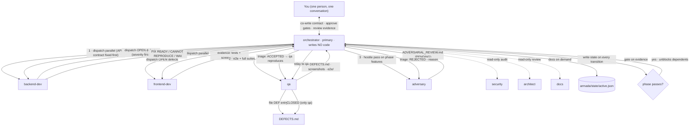

# opencode-armada — Architecture

*How armada works, and the ideas it's built on. Read this to understand the system — whether
you're contributing, dogfooding, or thinking about running a fleet on your own repo.*

---

## The one-sentence version

armada is a **generator that turns any repository into a self-organizing AI engineering team**:
a single orchestrator agent you talk to, backed by a crew of specialist subagents it dispatches
in parallel, all governed by evidence — no plugin required (an opt-in supervision plugin is
available but the default works with plain opencode).

## The mental model

```
        YOU                        THE FLEET
   (one person,              (many agents, one boss)
   one conversation)
        │                              ▲
        │  "ship the /about page"      │  phases, evidence, results
        ▼                              │
   ┌───────────────────┐         ┌─────────────────────────────────────┐
   │   ORCHESTRATOR     │────────►│ backend-dev   frontend-dev   qa     │
   │  (the only agent   │ delegate │ adversary    security       docs   │
   │   you ever talk to)│────────►│ architect                         │
   └───────────────────┘         └─────────────────────────────────────┘
        │                              │
        │  contract + state            │  disjoint files / worktrees
        ▼                              ▼
   ┌───────────────────────────────────────────────────────────────────┐
   │   THE REPO  (AGENTS.md, armada/contracts, armada/state, src/)      │
   └───────────────────────────────────────────────────────────────────┘
```

The core deal: **you steer with words and approvals; the fleet executes with tools.** You never
touch the code yourself if you don't want to — you shape the contract, the orchestrator does
everything else.

---

## The two engineering ideas armada combines

armada sits at the intersection of two recent, well-defined disciplines. Knowing both makes the
whole design legible.

### 1. Harness engineering

*Coined by OpenAI (see [References](#references)).* The insight: when an agent fails, the fix is
rarely "try harder" — it's **"what is the environment missing, and how do we make the right
behavior legible and enforceable?"** You engineer the *harness* around the agent: the repo
structure, the instructions, the invariants, the feedback loops. Humans steer; agents execute.

armada is a harness-engineering product:
- **The repo is the harness.** `AGENTS.md` (the playbook), `armada/REQUIREMENTS.md` (the
  contract), `.opencode/agent/*.md` (per-role prompts with real frontmatter: `mode`, `model`,
  `permission`).
- **Enforcement is mechanical, not aspirational.** Permissions are in the agent frontmatter
  and enforced by the SDK — the orchestrator literally cannot `edit` code (its `edit: { "*":
  "deny" }`), security/architect physically cannot write files. Boundaries aren't a promise in
  a prompt; they're a fact of the config.
- **Knowledge is progressive disclosure.** The orchestrator's prompt is the table of contents;
  the contract + state files hold the working detail. Agents read what they need, not the whole
  repo.
- **Feedback loops are built in.** qa gates every phase on evidence; the adversary runs a
  hostile review pass; defects flow through a ledger that only qa can close.

### 2. Loop engineering

*Popularized by Cobus Greyling and others (see [References](#references)).* The insight: stop
prompting agents one-off; **design loops that prompt the agents for you** — scheduler → triage
skill → sub-agents → verification → human gate → merge. "You shouldn't be prompting coding
agents anymore. You should be designing loops that prompt your agents."

armada is loop-engineering in its execution layer:
- **The orchestrator IS the loop.** It reads the contract, builds a dependency graph, dispatches
  ready phases in parallel as background subagents, collects evidence, gates, advances. That's a
  control loop: *plan → dispatch → verify → gate → next*.
- **Maker/checker split.** backend-dev/frontend-dev *make*; qa/adversary *check*. The loop
  never lets a maker pass its own work.
- **State is the loop's memory.** `armada/state/active.json` (active feature, phase graph,
  evidence, next action) + `armada/state/features/` index. The orchestrator reads it on session
  start and writes it on every transition — so a killed session resumes, and the loop is
  restart-proof (the loop-engineering "memory/state" building block).
- **The human is a gate, not a driver.** The loop runs; it pauses only for judgment —
  contract approval, an ambiguous decision, or a permission override.

**The distinction in one line:** harness engineering builds the *field* the agents play on;
loop engineering builds the *game* that runs on it. armada's generator is the harness; the
orchestrator's dispatch/gate/reconcile cycle is the loop.

---

## The lifecycle of a feature (the workflow you can copy)

This is the part that adapts to **any repo** — you don't need armada-the-tool to copy the
pattern; you need the loop + the harness.

### 0. Arm the repo (one-time)

```bash
npx opencode-armada init --yes --yolo
# or, for a fresh project:
npx opencode-armada new my-app --type web-app --beginner --yes
```

This writes the harness: `.opencode/agent/*.md`, `opencode.json`, `AGENTS.md`, and the
`armada/` state area. `--yolo` = autonomous (no permission prompts); it changes *permissions*,
never the *conversation*.

### 1. Co-write the contract (the interview)

Open opencode — it boots straight into the orchestrator. Describe the feature in plain language.
The contract (`armada/REQUIREMENTS.md`) is blank, so the orchestrator **does not build**. It
asks you one question at a time (scope, users, data, pages), drafts phases + success criteria,
and iterates until you **explicitly approve**.

> This is the moment that makes it feel like magic: the AI is asking *you* clarifying questions
> instead of guessing. It works because the contract is the *end-goal spec*, not a vague wish —
> and nothing ships until you agree it's right.

### 2. The orchestrator runs the loop

Once approved, the orchestrator:
1. Builds a **dependency graph** from the phases.
2. Dispatches **ready phases in parallel** as background subagents — backend-dev ∥ frontend-dev
   within a phase, independent phases concurrently.
3. **Gates each phase on evidence**: a passing test run, a screenshot, a file:line citation.
   Nothing advances without proof.
4. Sends **qa** for end-to-end tests + **adversary** for a hostile review pass on the finished
   work.
5. Writes every phase transition to `armada/state/active.json` — never ends a turn with
   unsaved state.

### 3. You approve; it merges; the state persists

You review the evidence, approve the outcome. The loop is restart-proof: kill the session
mid-feature, reopen, and the orchestrator reads state and reports *"resume: feature X, phase 2,
evidence in, next action Y."*

### Running multiple features (no clobbering)

Each feature is its own contract + state file. For true parallel isolation, **spawn a git
worktree per feature** — separate working trees can't collide, and merging is a per-feature
fast-forward. (This is the roadmap's multi-feature step; today features share the checkout and
rely on the "disjoint files" prompt rule.)

---

## The code, organized

```
src/
├── cli.js               entry + subcommands (new/init/feature/models/doctor/uninstall/ping/help)
├── index.js             library entry (programmatic API)
├── model-catalog.js     the 8 roles, curated models, budget tiers (free/balanced/power)
├── stack-detect.js      detect the tech stack from manifests/instruction files (monorepos too)
├── questionnaire.js     interactive setup (node readline, zero deps)
├── generator.js         PURE renderers — team, agent files, opencode.json, AGENTS.md, commands
├── scaffold.js          the I/O side — writes generated files, fills prompts, uninstall
├── state.js             the loop's memory — pure state schema + validators
├── feature-commands.js  per-feature contracts — feature new/list/close
├── doctor.js            environment health checks (opencode, providers, openrouter auth)
└── manifest.js          the armada.yaml schema + parser

agents/<role>/prompt.template.md   per-role system prompt with {placeholders}
presets/*.yaml                     budget presets
starter/<category>/                cookiecutter-style repo templates (agentic best practices)
```

**The key architectural invariant:** `generator.js` is **pure** (zero I/O) and `scaffold.js`
owns all file writes. Every decision is a function of the manifest + team; the generator is
deterministic and fully testable. `state.js` is likewise pure — the loop's memory is a data
structure, not a side effect.

---

## The fleet, role by role

| Role | Mode | What it owns | Can it write code? |
|---|---|---|---|
| **orchestrator** | primary | dispatch, gating, contract, state, the only agent you talk to | **No** — delegates everything |
| **backend-dev** | subagent | server, API, storage, backend tests | Yes (backend files) |
| **frontend-dev** | subagent | UI, visual polish, frontend tests | Yes (frontend files) |
| **qa** | subagent | e2e tests, screenshots, DEFECTS.md, the only one who closes defects | Only e2e/ + screenshots |
| **adversary** | subagent | hostile review, breaks the running app, ADVERSARIAL_REVIEW.md | **No** — read-only attacker |
| **security** | subagent | vulnerability/authz audit | **No** — read-only auditor |
| **docs** | subagent | README, API docs, changelog | Docs only |
| **architect** | subagent | architecture, refactor risk, cross-cutting review | **No** — read-only reviewer |

The boundaries are **enforced by permissions in the agent frontmatter** — not by prompt
politeness. The SDK resolves the most specific rule first, so a read-only role physically
cannot edit, and the orchestrator physically cannot do its own code writes.

### The relationship graph

How the roles actually interact at runtime. Solid arrows are mandatory steps in the orchestrator's
per-phase loop; dashed arrows are on-demand, read-only dispatches. Every arrow back to the
orchestrator carries evidence — a test run, a screenshot, or a `path:line` citation.



What the graph encodes:

- **Writes route down, evidence flows up.** The orchestrator physically cannot `edit` code
  (`edit: { "*": "deny" }`); workers own disjoint file slices; qa owns `e2e/` + `DEFECTS.md`.
  Every return arrow is proof, never a report of intent.
- **The per-phase loop is fixed, not discretionary.** Steps 1-3 (developers → qa → adversary)
  run for *every* phase — the orchestrator only chooses scope, never whether a gate runs.
  Security/architect/docs (dashed) are the only optional dispatches, on demand.
- **The defect loop is closed.** Only qa can set CLOSED; the orchestrator relays developer
  statuses (FIX READY / CANNOT REPRODUCE / WORKING AS INTENDED) and may only REJECT, with a
  written reason.
- **State is the loop's memory.** The orchestrator writes `armada/state/active.json` on every
  transition (hard rule: never end a turn with unsaved state), which is what makes a killed
  session resumable.
- **The graph matches the prompts.** This diagram is a rendering of the steps in
  `agents/orchestrator/prompt.template.md` (per-phase execution + defects + adversary triage) —
  not an idealized design. If the code and this graph ever disagree, the prompts are truth.

---

## The tools that make the loop observable

- **`armada feature new/list/close`** — per-feature contracts + state index. `close` is
  evidence-gated: it refuses until every criterion has a passing test or citation.
- **`/armada-status`** — reads `armada/state/active.json` + the features index.
- **`/armada-resume`** — the human-facing restart wrapper.
- **`/armada-scout`** — dispatch a read-only investigation (adversary/architect), no writes.
- **`armada doctor`** — checks the harness: opencode, providers, openrouter auth, background
  dispatch, supervision-plugin presence.
- **`npm run test:smoke`** — live OpenRouter smoke against the cheapest model (opt-in).

---

## The self-improvement loop

armada uses itself. `docs/armada-improves-armada.md` documents the two-lane workflow:
- **Lane A — Audit:** the fleet reviews armada's own code, files findings.
- **Lane B — Feature:** the fleet implements armada's next feature (in a `sandbox/<name>/`
  worktree so the live repo stays clean).

It has proven itself: the fleet built armada's own session-based state system (~26 minutes,
$0.18, autonomous `--yolo`), surfaced a real permission deadlock and asked the right question,
and self-corrected 3 test failures it introduced while writing its own code. **That's the
million-dollar property: a system that can improve the system.**

---

## References (for education)

**Harness engineering**
- OpenAI, *"Harness engineering"* — https://openai.com/index/harness-engineering/
  (environment design, `AGENTS.md` as system of record, feedback loops, "humans steer, agents
  execute")
- Anthropic, *"Building effective agents"* — https://www.anthropic.com/engineering/building-effective-agents
  (workflows vs agents, and how the harness/loop shape what the agent can do)

**Loop engineering**
- Cobus Greyling, *"Loop Engineering"* — https://github.com/cobusgreyling/loop-engineering
  (the five building blocks: automations, worktrees, skills, plugins, sub-agents + memory; the
  seven loop patterns)
- Boris Cherny / Anthropic on loops — "I don't prompt Claude anymore. I have loops running
  that prompt Claude." (loop-engineering's origin quote)

**Agent teams & worktrees**
- firstmate — https://github.com/kunchenguid/firstmate
  (an agent distro running crews: per-task worktrees, event-driven supervision, restart-proof
  state — the clearest "loop engineering as a product")

**Project scaffolding**
- Cookiecutter — https://github.com/cookiecutter/cookiecutter
  (template-driven project generation; armada's `new` command is cookiecutter-inspired)

---

## Module map (contributor quick-ref)

See [SPEC.md](./SPEC.md) for design decisions and [TODO.md](../TODO.md) for the roadmap.
The rest of this file's module map and data-flow diagrams live above; for the mechanical
rendering pipeline, see [src/](src/) and the tests in [tests/](tests/).
