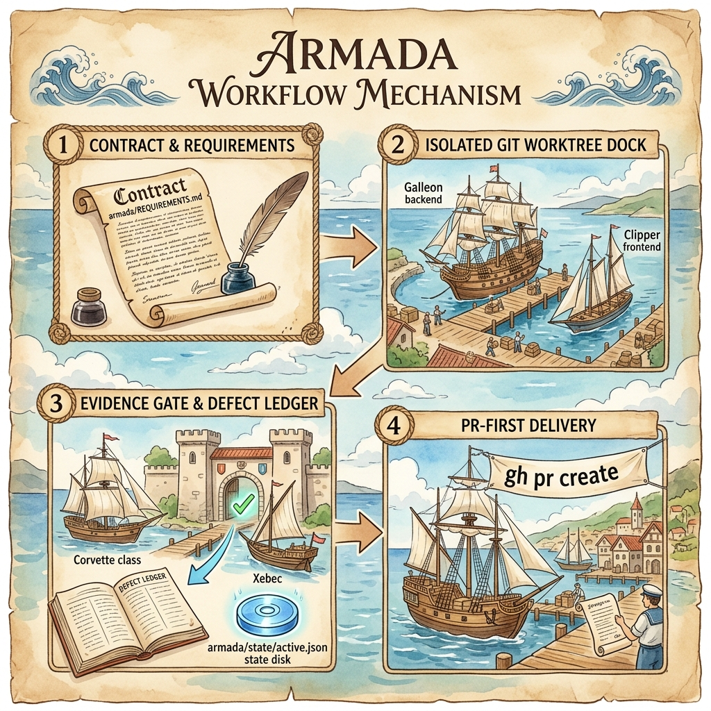

<p align="center">
  
</p>

<h1 align="center">armada</h1>

<p align="center">
  <strong>Turn any repository into a self-organizing AI engineering team.<br/>
  One command. 8 specialists. Evidence-gated delivery.</strong>
</p>

<p align="center">
  <a href="https://www.npmjs.com/package/armada"></a>
  <a href="./LICENSE"></a>
  <a href="https://nodejs.org">= 20" /></a>
  <a href="https://github.com/rafmacalaba/armada/actions"></a>
  <!-- Uncomment when numbers are worth showing:
  <a href="https://www.npmjs.com/package/armada"></a>
  <a href="https://github.com/rafmacalaba/armada"></a>
  -->
</p>

---

## The problem

**Solo AI coding agents are reckless.** Left unguided, a single agent will guess requirements instead of asking, skip test verification, clobber your working tree with half-baked code, and lose all progress when a session crashes or times out. You get code, sure — but no proof it works, no separation between builder and reviewer, and a mess on your main branch.

## What armada does

armada turns your repository into a **self-organizing AI engineering fleet**. Instead of a solo agent guessing across your codebase, armada scaffolds 8 specialist agents governed by SDK-enforced boundaries, evidence-gated phase criteria, restart-proof state, and isolated Git worktrees (`sandbox/<name>`).

**Today it works with [opencode](https://opencode.ai).** Support for **Claude Code** and **Codex** is on the roadmap — the architecture is harness-agnostic, so extending to other AI coding tools is a matter of renderers, not a rewrite.

**The key idea:** As **Admiral** [user], you command one contact: the **Commodore** [orchestrator]. You co-write a contract with the Commodore (or delegate contract drafting directly to it from a PRD), the Commodore dispatches specialists in parallel across clean worktree docks, QA audits evidence, and completed work lands cleanly as a reviewed Pull Request (`gh pr create`).

---

## Quick start

```bash
# 1. Install globally (enables 'armada' command anywhere)
npm install -g armada

# 2. New project — Interactive: picks category from a questionnaire, fills vars, scaffolds
armada new my-app
cd my-app
opencode                              # Commodore welcomes you

# Non-interactive variants:
armada new my-app --blank              # empty project + armada team, no prompts
armada new my-app --config ./vars.json # vars from JSON, category still asked
armada new my-app --yes                # defaults, no prompts

# 3. Existing repo (auto-detects stack & scaffolds team)
cd your-repo
armada init
opencode                              # start building

# Isolated feature voyage (keeps main clean)
armada feature new my-feature --worktree
armada voyage sandbox/my-feature
```

> **Prefer zero install via `npx`?** Run `npx armada new my-app` or `npx armada init`.
> **Not sure it works?** Run `armada doctor` after init to check opencode, providers, and models in one pass.

---

## How it works

<p align="center">
  
</p>

```
       ADMIRAL [You]                 THE FLEET
    [one human user,            [8 agents, one boss]
    one conversation]
         |                               ^
         |  "ship the /about page"       |  phases, evidence, results
         v                               |
    +-------------------+          +-------------------------------------+
    |    COMMODORE      |--------->| backend-dev   frontend-dev   qa     |
    |  [orchestrator,   | delegate | adversary    security       docs   |
    |   only contact]   |--------->| architect                         |
    +-------------------+          +-------------------------------------+
         |                               |
         |  contract + state             |  disjoint files / worktrees
         v                               v
    +-------------------------------------------------------------------+
    |  WORKTREE  [sandbox/<feature>, AGENTS.md, REQUIREMENTS.md, state] |
    +-------------------------------------------------------------------+
```

**The workflow:**

1. **Co-write the contract — or delegate to the Commodore.** Describe your goal in plain language, drop in a raw wish, or paste a full PRD. The Commodore interviews you (or drafts the contract autonomously if delegated), breaking down your goal into phases with measurable success criteria (`armada/REQUIREMENTS.md`). No code is ever written against an unapproved contract.

2. **Parallel execution in isolated worktrees.** Once approved, the Commodore dispatches ready phases in parallel to specialist background subagents — backend (Galleon [backend-dev]) and frontend (Clipper [frontend-dev]) work concurrently on disjoint file slices inside an isolated Git worktree dock (`sandbox/<feature>`), keeping `main` pristine.

3. **Evidence-gated QA & adversarial review.** Specialists don't self-certify. After each phase, QA (Corvette [qa]) runs E2E tests and captures screenshots, while the adversary (Xebec [adversary]) performs a hostile pass to break the app. Defects flow through a structured ledger (`DEFECTS.md`) that only QA can close.

4. **PR-First finish.** When all phase criteria pass, the Commodore opens a reviewed Pull Request (`gh pr create`) from the feature branch. Your main branch stays untouched until you review and merge.

5. **Restart-proof state engine.** Every transition is persisted to disk (`armada/state/active.json`). If a session crashes, times out, or closes, running `armada resume` or reopening opencode picks up right where it left off — zero lost context.

---

## What makes it different

| | Raw opencode | Hand-written AGENTS.md | **armada** |
|---|:---:|:---:|:---:|
| Multi-agent orchestration | Manual | Manual | **Automated** |
| Main branch protection | None (clobbers tree) | Manual | **Isolated Git worktrees** (`sandbox/<name>`) |
| Parallel feature runs | Impossible | Cluttered conflicts | **Multiple concurrent worktrees** |
| Evidence gating | None | Aspirational (prompt-based) | **Enforced** (test runs, screenshots) |
| Role boundaries | None | Prompt-based | **SDK-enforced** (permissions in frontmatter) |
| Live session steering | None | None | **Attachable Tmux sessions** (`armada voyage` / `tmux attach`) |
| Delivery flow | Direct pushes | Uncontrolled | **PR-First** (`gh pr create`) |
| Restart-proof state | None | None | **Built-in** (survives crashes) |
| Defect lifecycle | None | None | **Structured ledger** (only QA closes) |
| Reproducible | N/A | Copy-paste | **Manifest** (`armada.yaml` -> identical team) |
| Setup time | N/A | Hours | **One command** |

---

## Meet the Fleet

8 AI specialists under your command, each governed by SDK-enforced permissions — not prompt politeness.

* **Admiral [You]** — The high commander. Directs the fleet, approves contracts, reviews evidence, and merges PRs.
* **Commodore [orchestrator]** — Delivery lead & scheduler. Co-writes contracts, dispatches specialists, and gates evidence. *Physically cannot edit code (`edit: deny`).*
* **Galleon [backend-dev]** — Heavy backend engineer. Builds server logic, APIs, databases, and backend unit tests.
* **Clipper [frontend-dev]** — Fast UI/UX developer. Builds components, styling, responsive pages, and client tests.
* **Corvette [qa]** — Quality assurance officer. Writes E2E tests, captures screenshots, and owns `DEFECTS.md`. *The only role that can close a defect.*
* **Xebec [adversary]** — Hostile reviewer. Performs hostile passes on finished phases, hunting for edge cases, security vulnerabilities, and UI flaws.
* **Frigate [security]** — Security auditor. Audits auth, permissions, data leaks, and dependency vulnerabilities. *Read-only.*
* **Caravel [docs]** — Technical scribe. Maintains READMEs, API docs, changelogs, and user manuals.
* **Bark [architect]** — Naval architect & reviewer. Analyzes code structure, refactoring risks, and pattern compliance. *Read-only.*

### Role permissions matrix

| Role key | Title / Display name | Role | Can write code? | Permission boundaries |
|---|---|---|:---:|---|
| `user` | **Admiral [You]** | High Commander | N/A | Full control |
| `orchestrator` | **Commodore** [orchestrator] | Delivery Lead | No | `edit: { "*": "deny" }` |
| `backend-dev` | **Galleon** [backend-dev] | Backend Dev | Yes | Server & database files |
| `frontend-dev` | **Clipper** [frontend-dev] | Frontend Dev | Yes | Client & UI files |
| `qa` | **Corvette** [qa] | Quality Assurance | Tests only | `armada/e2e/`, `armada/ledgers/`, `armada/screenshots/` |
| `adversary` | **Xebec** [adversary] | Hostile Auditor | Read-only | Ledgers & screenshots |
| `security` | **Frigate** [security] | Security Audit | Read-only | `edit: { "*": "deny" }` |
| `docs` | **Caravel** [docs] | Documentation | Docs only | Markdown & doc files |
| `architect` | **Bark** [architect] | Code Review | Read-only | `edit: { "*": "deny" }` |

The Commodore physically cannot edit code (`edit: { "*": "deny" }`). Security and architect physically cannot write files. These aren't suggestions — they're facts of the configuration.

---

## Key features

### Git Worktree Isolation & Pristine Main
Never worry about AI agents messing up your working tree or leaving half-finished code on `main`. Each feature voyage runs inside its own Git worktree (`sandbox/<name>`) on an isolated branch. You can run multiple feature voyages in parallel without cross-feature collisions.

### Live Tmux Steering & Fleet Observability
Feature voyages execute in background tmux sessions ("ships"). As the Admiral, you are never locked out: attach to any live voyage (`armada voyage sandbox/<name>` or `tmux attach`) at any time to watch the Commodore in real time, answer clarifying questions, or steer implementation. Use `armada fleet` for a cross-repo dashboard of all active docks.

### PR-First Delivery
A voyage is done only when it opens a reviewed Pull Request (`gh pr create`). No direct pushes to main, no unreviewed local merges. The fleet presents evidence, QA verifies, and opens the PR for the Admiral's approval.

### Evidence-gated phases
Every phase has success criteria. A phase passes only when those criteria are demonstrated by
a passing test run, a screenshot, or a file:line citation. No "trust me, it works."

### SDK-Enforced Role Boundaries
Boundaries aren't prompt politeness — they're enforced by the SDK permissions in agent frontmatter. The Commodore cannot edit code (`edit: { "*": "deny" }`), and read-only roles physically cannot modify files.

### Parallel execution
Independent phases run as parallel background subagents. The Commodore assigns disjoint
file slices so backend and frontend never collide. Dependent phases wait; independent ones fly.

### Contract-first development
The Commodore co-writes a requirements contract with you before writing any code. Phases,
success criteria, dependencies — all agreed before the first line ships. Think of it as TDD
for the entire feature.

### Restart-proof state
`armada/state/active.json` captures the active feature, phase graph, evidence, and next
action. Kill the session, reopen, and `armada resume` picks up where you left off — no
re-prompting, no lost context.

### Self-improving
armada uses itself. The fleet built armada's own session-based state system autonomously
(~26 minutes, $0.18 with `--yolo`), surfaced a real permission deadlock, and self-corrected
3 test failures it introduced while writing its own code. A system that can improve the system.

---

## What armada is NOT

- **Not a plugin.** armada writes files; your AI coding tool runs them. No hooks, no runtime.
- **Not an orchestration engine.** The AI coding tool IS the runtime. armada emits the team.
- **Not a runtime dependency.** Run `armada init` once; the repo doesn't need armada afterward.
- **Not opencode-only forever.** opencode is the reference implementation today. Claude Code
  and Codex support are planned — the generator architecture (per-harness renderers) is
  designed for it. See [SPEC.md](./SPEC.md) and [TODO.md](./TODO.md).

---

## The 11 commands

| Command | What it does |
|---|---|
| `armada init` | Scaffold the team into an existing repo |
| `armada new <name>` | Create a new project: interactive questionnaire or first-party template |
| `armada doctor` | Environment health check |
| `armada status` | Where the fleet is: active feature, phase, next action |
| `armada fleet` | Cross-repo per-lane progress dashboard |
| `armada voyage <lane>` | Boot a lane session for feature work |
| `armada feature <new\|list\|close>` | Per-feature contract management |
| `armada models [budget]` | Curated model catalog (free / balanced / power) |
| `armada resume` | Resume after an interrupted session |
| `armada uninstall` | Remove armada-generated artifacts |
| `armada help` | Usage and version |

Four slash commands run inside the opencode TUI: `/armada`, `/armada-scout`, `/armada-voyage`,
`/armada-resume`.

---

## armada new: First-party templates

`armada new <name>` without flags runs an interactive questionnaire: it asks which category
to scaffold, then fills template variables (TTY only — non-TTY defaults to `blank`). Six
categories ship with armada:

| Category | Stack | When to use |
|---|---|---|
| `blank` | (empty) | Clean slate — just the armada team, no project shell |
| `web-app` | TypeScript + Vite + React | Browser app |
| `ml-training` | Python 3 | ML experiments, training scripts |
| `research-paper` | LaTeX | Academic writing, BibTeX |
| `api-service` | TypeScript + Express | HTTP service with health endpoint |
| `cli-tool` | TypeScript + commander | CLI binary with subcommands |

Pick a category non-interactively with `--blank` or `--config ./vars.json` (see flags below).

> **`armada new` already runs `armada init`.** After `armada new` completes, the armada team
> is already in the project — do NOT run `armada init` separately. Use `armada init` only for
> in-place setup of existing repos.

## Advanced: external templates

Power users can point `armada new` at any cookiecutter-compatible template:

```bash
# Git URL — fetches the repo, renders cookiecutter placeholders
armada new my-app --template https://github.com/cookiecutter/cookiecutter-django
armada new my-app --template https://github.com/your-org/your-template

# Local path — copies the template directory
armada new my-app --template ./my-local-template

# Pass variables without prompts
armada new my-app --template <url> --config ./vars.json
```

Backward compatible: `--template` is optional, not required. Any template with
`{{ cookiecutter.varname }}` placeholders works. Variables are resolved from
`--config <file.json>`, `COOKIECUTTER_*` env vars, or interactive prompts. Git URL templates
are fetched via `git clone --depth 1`. Supported patterns: `{{ cookiecutter.varname }}`
(Jinja2 conditionals and loops are not supported in v1).

## armada new: Flags

| Flag | Effect |
|---|---|
| `--blank` | Skip questionnaire, use `blank` template |
| `--template <url\|path>` | Use an external template (clones git URL, copies local path) |
| `--config <file.json>` | Vars from JSON file (overrides prompts) |
| `--yes` | Use defaults, skip all prompts |

---

## What you get (scaffolded files)

```
your-repo/
+-- opencode.json                     # model + default_agent (never clobbers existing)
+-- AGENTS.md                         # playbook: team roles, defect ledger, phase gates
+-- armada/
|   +-- armada.yaml                   # manifest: source of truth, re-runnable
|   +-- REQUIREMENTS.md               # contract: phases + success criteria
|   +-- state/                        # loop memory: restart-proof
|   +-- ledgers/<feature>/            # DEFECTS.md, ADVERSARIAL_REVIEW.md, SECURITY_FINDINGS.md
|   +-- e2e/<feature>/                # per-feature e2e evidence (qa-owned)
|   +-- screenshots/<feature>/        # per-feature screenshot evidence
+-- .opencode/
    +-- agent/                        # 8 native agents with mode/model/permission frontmatter
    +-- commands/                     # 4 slash commands
```

`armada init` never clobbers existing `opencode.json` or `AGENTS.md`. It always (re)writes
`armada/armada.yaml` and the `.opencode/` artifacts it owns. Re-scaffold from the manifest at any
time: `armada init --from-armada armada/armada.yaml` produces the identical team — byte for byte.

---

## Documentation

| Document | What it covers |
|---|---|
| [Getting Started](./docs/getting-started.md) | Install, first project, first feature — the tutorial |
| [Operator Manual](./docs/using-armada.md) | The 11 commands in detail, full flag table, model catalog |
| [Architecture](./ARCHITECTURE.md) | How armada works: harness engineering + loop engineering |
| [Self-Improvement](./docs/self-improvement.md) | How armada uses itself to build itself |
| [SPEC.md](./SPEC.md) | Design decisions and manifest schema |
| [TODO.md](./TODO.md) | The roadmap |

---

## Built on & Inspirations

armada sits at the intersection of proven software tooling and modern AI engineering:

- **[Cookiecutter](https://github.com/cookiecutter/cookiecutter)** — the original inspiration for template-driven project generation. Just as Cookiecutter paved the way for scaffolding clean, reproducible codebases, armada applies that pure generator model to AI: it scaffolds full multi-agent fleets into any repository without requiring a runtime plugin or daemon.
- **[Harness engineering](https://openai.com/index/harness-engineering/)** (OpenAI) — engineer the environment around the agent, not the agent itself. The repo structure, the playbook, the permissions, the feedback loops.
- **[Loop engineering](https://github.com/cobusgreyling/loop-engineering)** — stop prompting agents one-off; design loops that prompt the agents for you. Plan, dispatch, verify, gate, next.

The generator is the Cookiecutter-style harness; the Commodore's dispatch/gate/reconcile cycle is the loop.

---

## Roadmap highlights

- **Multi-harness** — Claude Code and Codex renderers (same team, different runtimes)
- **Skills integration** — fleet-specific skills shipped into generated repos
- **Dashboard TUI** — real-time `armada fleet --watch`
- **Role roster tuning** — right-sizing the 8-role team based on real sessions

Full roadmap in [TODO.md](./TODO.md).

---

## License

MIT. See [LICENSE](./LICENSE).
